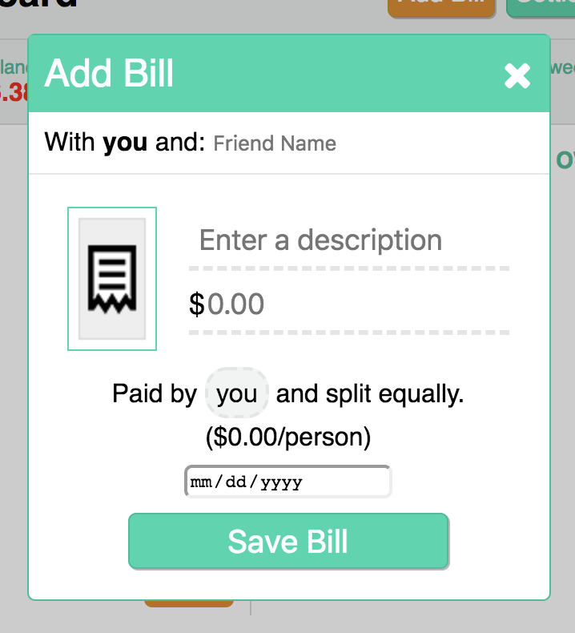
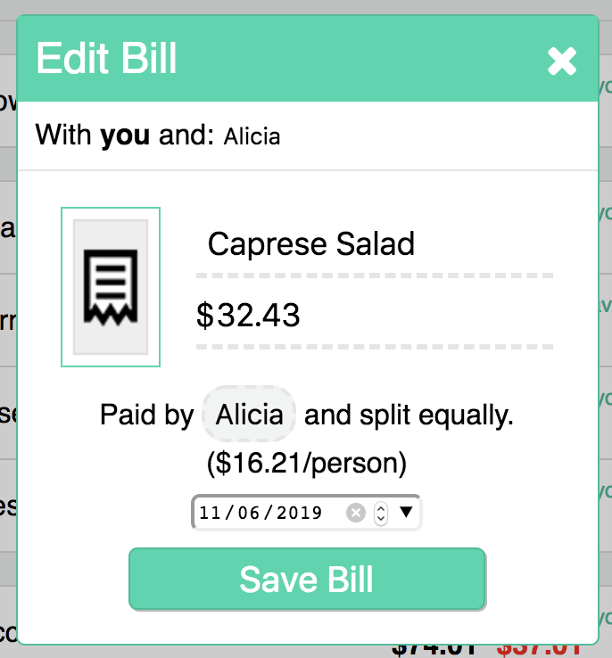
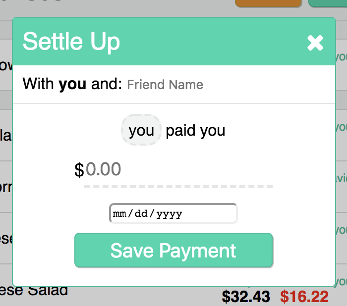

# README

# MANO!MIDINERO?

MANO!MIDINERO? is a full-stack single page application that allows users to keep track of expenses with their friends.

Backend: Ruby on Rails, PostgreSQL  
Frontend: React, Redux, HTML5, CSS3, jQuery, Vanilla Javascript

[Live Link](https://manomidinero.herokuapp.com/#/)

## Features

### Bills

Bill information is stored in two tables in the database (bills and bill_splits).  Two tables were needed in order to store both the information of the bill as well as the split amounts of each user associated to the bill.

Users interact with a modal component when adding or editing bills.  The modal was a single component that was mapped with different props using Connect from the react-redux library.

### Payments

Payments are stored in a single table, named payments, in the database.  Payments store an amount in conjunction with a foreign key column called friendship_id.  The purpose of using the friendship id is to be able to have access to both users the payment is registered to through association.

### Joins Tables

The database has three joins tables:

The bill_splits table is used to store the amount each user owes toward a specific bill by referencing the bill and user as foreign keys.  
The shared_bills joins tables is used to store foreign keys that reference bills and friendships.  This table is used to expedite the deletion of bills when a friendship is deleted in the database.  
The friendships table stores references to each user part of a friendship.

The three joins tables, has many/through associations, and logic in the controllers on the backend allow for an efficient implementation of the CRUD features for friends, bills, and payments.
